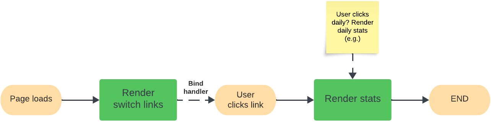

# Frontend Mentor - Time tracking dashboard

This is a solution to the [Time tracking dashboard challenge on Frontend Mentor](https://www.frontendmentor.io/challenges/time-tracking-dashboard-UIQ7167Jw). Frontend Mentor challenges help you improve your coding skills by building realistic projects.

Difficulty: `junior`

[//]: # 'Insert screenshot below'

## Preview

Preview of the challenge.

_Source: [time tracking dashboard challenge on Frontend Mentor](https://www.frontendmentor.io/challenges/time-tracking-dashboard-UIQ7167Jw)_

## Table of contents

- [Frontend Mentor - Time tracking dashboard](#frontend-mentor---time-tracking-dashboard)
  - [Preview](#preview)
  - [Table of contents](#table-of-contents)
  - [Deployment status](#deployment-status)
  - [Overview](#overview)
    - [The challenge](#the-challenge)
      - [Expected behavior](#expected-behavior)
    - [Links](#links)
  - [Project information](#project-information)
    - [User stories and features](#user-stories-and-features)
    - [Flowchart](#flowchart)
  - [Author](#author)

## Deployment status

## Overview

### The challenge

To build the time tracking dashboard according to the given designs as close as possible.
The users should be able to:

- View the optimal layout for the site depending on their device's screen size
- See hover states for all interactive elements on the page
- Switch between viewing Daily, Weekly, and Monthly stats

#### Expected behavior

- The text for the previous period's time should change based on the active time frame. For Daily, it should read "Yesterday" e.g "Yesterday - 2hrs". For Weekly, it should read "Last Week" e.g. "Last Week - 32hrs". For monthly, it should read "Last Month" e.g. "Last Month - 19hrs".

### Links

- Solution URL: [Open GitHub repository](https://github.com/YariMorcus/fm-time-tracking-dashboard)

[//]: # 'Insert following when online: - Live Site URL: [open Netlify / GitHub page][fill in link]'

## Project information

### User stories and features

1. As a user I want to be able to switch between daily, weekly, and monthly stats. This so I can get a clear picture of the separate times.

   **Features**

   |     |                                                                                       |
   | --- | ------------------------------------------------------------------------------------- |
   | 1   | A link that makes it possible to switch to the daily stats                            |
   | 2   | A link that makes it possible to switch to the weekly stats                           |
   | 3   | A link that makes it possible to switch to the monthly stats                          |
   | 4   | Based on the active time frame, the text of the previous period's time will change \* |

\* _Explanation_

- For daily: yesterday _(e.g. Yesterday - 2hrs)_
- For weekly: last week _(e.g. Last week - 32hrs)_
- For montly: Last month _(e.g. Last month - 19hrs)_

### Flowchart

## Author

- LinkedIn - [Yari Morcus](https://www.linkedin.com/in/yarimorcus) _(must be logged in)_
- Frontend Mentor - [@YariMorcus](https://www.frontendmentor.io/profile/YariMorcus)
