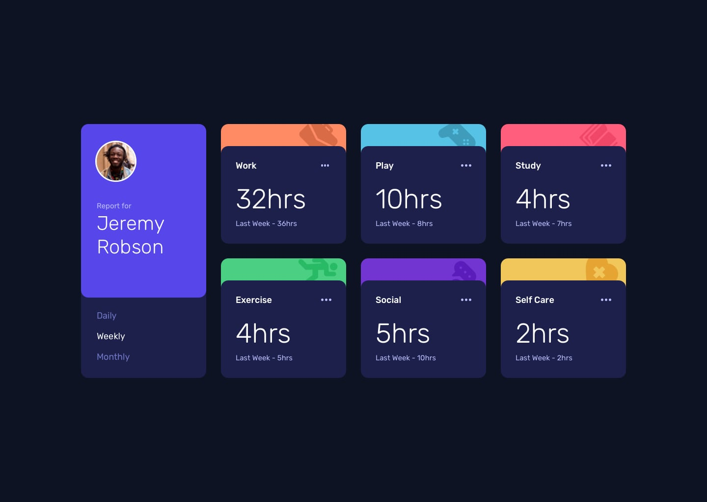

# Frontend Mentor - Time tracking dashboard

This is a solution to the [Time tracking dashboard challenge on Frontend Mentor](https://www.frontendmentor.io/challenges/time-tracking-dashboard-UIQ7167Jw). Frontend Mentor challenges help you improve your coding skills by building realistic projects.

Difficulty: `junior`

[//]: # 'Insert screenshot below'

## Preview

Preview of the challenge.

_Source: [time tracking dashboard challenge on Frontend Mentor](https://www.frontendmentor.io/challenges/time-tracking-dashboard-UIQ7167Jw)_

## Table of contents

- [Frontend Mentor - Time tracking dashboard](#frontend-mentor---time-tracking-dashboard)
  - [Preview](#preview)
  - [Table of contents](#table-of-contents)
  - [Deployment status](#deployment-status)
  - [Overview](#overview)
    - [The challenge](#the-challenge)
      - [Light mode](#light-mode)
      - [Expected behavior](#expected-behavior)
    - [Links](#links)
  - [My process](#my-process)
    - [Built with](#built-with)
    - [What I learned](#what-i-learned)
    - [Continued development](#continued-development)
    - [Useful resources](#useful-resources)
  - [Project information](#project-information)
    - [User stories and features](#user-stories-and-features)
    - [Flowchart](#flowchart)
  - [Author](#author)

## Deployment status

## Overview

### The challenge

To build the time tracking dashboard according to the given designs as close as possible.
The users should be able to:

- View the optimal layout for the site depending on their device's screen size
- See hover states for all interactive elements on the page
- Switch between viewing Daily, Weekly, and Monthly stats

#### Light mode

As an extra challenge, I decided to implement a light mode version as well. The light mode can be toggled on by pressing the toggle button in the right bottom corner. The user preference will be saved by the usage of a cookie in the browser.

#### Expected behavior

- The text for the previous period's time should change based on the active time frame. For Daily, it should read "Yesterday" e.g "Yesterday - 2hrs". For Weekly, it should read "Last Week" e.g. "Last Week - 32hrs". For monthly, it should read "Last Month" e.g. "Last Month - 19hrs".

### Links

- Solution URL: [Open GitHub repository](https://github.com/YariMorcus/fm-time-tracking-dashboard)
- Live Site URL: [open Netlify](https://time-tracking-dashboard-yari-morcus.netlify.app)

## My process

### Built with

- Semantic HTML5 markup
- CSS _(BEM naming convention used, [see getbem.com](http://getbem.com) for more information)_
- Flexbox
- CSS Grid
- ES6 classes
- Mobile-first workflow
- Optimized for both Open Graph (Facebook) and Twitter Cards
- [Node.js](https://nextjs.org/) - Open source and multi platform JavaScript runtime environment
- [NPM](https://www.npmjs.com/) - Package Manager for Node JavaScript platform
- [Parcel](https://parceljs.org/) - Zero configuration build tool / module bundler to automate workflow
- [Sass](https://sass-lang.com/) - CSS Preprocessor (in collaboration with Parcel)
- [GitHub](https://github.com/) - Technological platform based on Git
- [Git](https://git-scm.com/) - Free and open source distributed version control system
- [Netlify](https://www.netlify.com/) - Free service to host static webpages and web applications

### What I learned

1. Always use semantic compliant-standard HTML
2. What JSON is and how it works
3. To keep testing the application for Web Accessibility
4. To spend time looking at the details of the designs to create the application as accurately as possible
5. How to solve problems with a framework _(provided by a [course](https://www.udemy.com/course/the-complete-javascript-course/) I followed)_
6. How to create a flowchart based on the given project information

### Continued development

The way I want to continue to develop myself is by focusing on laying out a proper foundation of HTML, CSS, and JavaScript.
This so I can build quality websites for clients by just using the core languages of the Web.
At the present, I am working on the above things by going through (interactive) articles on the MDN Web Docs (see chapter [Useful resources](#useful-resources)).

Another way I want to improve my knowledge of these subjects is to do more challenges that [Frontend Mentor](https://www.frontendmentor.io/challenges) is offering, starting at the lowest level, and building that up to the more advanced ones.

Besides the above, I want to continue to develop myself by using several tools more often to improve my workflow. and spend less time doing things that can be automated.

A few tools that I will start using more often are:

1. Gulp
2. Parcel
3. Git
4. GitHub
5. Netlify (in combination with Continues Deployment)

_I will learn the above points in between but do not want to focus too much on those at the moment._

As soon as I am capable of creating quality websites with the core languages of the Web, I will start to learn JavaScript libraries and frameworks. Both of these change over time, so I do not want to spend my time on those before I have a solid understanding of prior mentioned languages.

### Useful resources

- [Transfonter](https://transfonter.org) - Has been used to convert the downloaded font files to woff and woff2 (most recent font formats, supported in all major browsers), and generate the corresponding `@font-face` css rulesets
- [Frontend Mentor - Time tracking dashboard challenge on Frontend Mentor](https://www.frontendmentor.io/challenges/time-tracking-dashboard-UIQ7167Jw)

## Project information

### User stories and features

1. As a user I want to be able to switch between daily, weekly, and monthly stats. This so I can get a clear picture of the separate times.

   **Features**

   |     |                                                                                       |
   | --- | ------------------------------------------------------------------------------------- |
   | 1   | A link that makes it possible to switch to the daily stats                            |
   | 2   | A link that makes it possible to switch to the weekly stats                           |
   | 3   | A link that makes it possible to switch to the monthly stats                          |
   | 4   | Based on the active time frame, the text of the previous period's time will change \* |

\* _Explanation_

- For daily: yesterday _(e.g. Yesterday - 2hrs)_
- For weekly: last week _(e.g. Last week - 32hrs)_
- For montly: Last month _(e.g. Last month - 19hrs)_

### Flowchart

## Author

- LinkedIn - [Yari Morcus](https://www.linkedin.com/in/yarimorcus) _(must be logged in)_
- Frontend Mentor - [@YariMorcus](https://www.frontendmentor.io/profile/YariMorcus)
